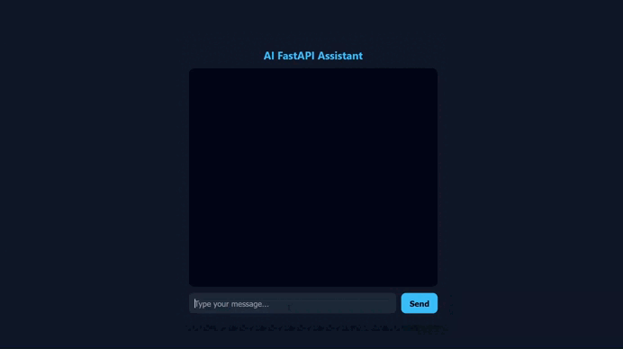

# AI FastAPI Assistant

Minimal full-stack project demonstrating how to integrate an AI-like assistant into a FastAPI application with persistent chat history using SQLite and a simple frontend interface.



---

## Overview

This project is a **portfolio-ready full-stack application** that simulates an AI assistant system.

Key characteristics:
- Clean backend architecture (FastAPI)
- Integrated frontend (HTML + CSS + JS)
- SQLite for persistence
- Mocked AI responses (zero cost)
- Single-command execution

---

## Features

- `/chat` API endpoint
- Interactive chat UI (frontend)
- Chat history storage in SQLite
- Mock AI response system (no API cost)
- Frontend served directly by FastAPI
- No external tools required (no Live Server)

---

## Project Structure

```
ai-fastapi-app/
│
├── app/
│   ├── api/
│   ├── core/
│   ├── db/
│   ├── schemas/
│   ├── services/
│   └── frontend/ #HTML, CSS, JS
│
├── requirements.txt
├── README.md
└── .gitignore
```

---

## Installation

### 1. Clone the repository

```bash
git clone <your-repo-url>
cd ai-fastapi-app
```

### 2. Create virtual environment

```bash
python -m venv venv
venv\\Scripts\\activate
```

### 3. Install dependencies

```bash
pip install -r requirements.txt
```

---

## Running the Application

```bash
uvicorn app.main:app --reload
```

Access the application at:

```
http://127.0.0.1:8000
```

---

## How It Works

- FastAPI serves both:
  - Backend API (`/chat`)
  - Frontend (HTML, CSS, JS)
- Frontend communicates with backend via `fetch('/chat')`
- Responses are displayed in a chat-style UI
- Messages are stored in SQLite

---

## API Endpoint

### POST `/chat`

#### Request

```json
{
  "message": "Hello"
}
```

#### Response

```json
{
  "response": "Hello. How can I assist you today?"
}
```

---

## Frontend

- Chat-style interface
- Real-time message rendering
- No page reload (AJAX via fetch)
- Styled message bubbles (user vs AI)

---

## Database

- SQLite database: `chat.db`
- Table: `chat_history`

Fields:
- `id`
- `user_message`
- `ai_response`

---

## AI Mode (Mock vs Real)

Located in:

```
app/services/openai_service.py
```

```python
USE_MOCK = True
```

### Mock Mode (default)
- No cost
- Deterministic responses
- Ideal for demos

### Real Mode

```python
USE_MOCK = False
```

Requires:

```
OPENAI_API_KEY=your_key_here
```

---

## Development Notes

- Static files are served via FastAPI (`/static`)
- Cache may require versioning during development:

```html
<link rel="stylesheet" href="/static/style.css?v=2">
<script src="/static/app.js?v=2"></script>
```

---

## Limitations

- No conversation context (single message only)
- No user/session separation
- No authentication
- No streaming responses
- Basic error handling
- SQLite not suitable for production scale

---

## Suggested Improvements

- Add conversation history context
- Introduce user/session IDs
- Migrate SQLite → PostgreSQL
- Add authentication
- Implement streaming responses
- Improve UI/UX (animations, typing indicator)

---

## Purpose

This project demonstrates:

- Backend architecture with FastAPI
- Frontend-backend integration
- API design and persistence
- Building AI-ready systems without external cost

---

## License

MIT License
